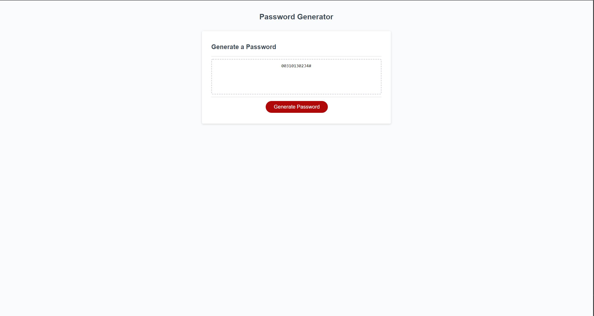

# Password-Generator

## Description

Built to create secure passwords for employees with access to sensitive data.

Using a combination of HTML and Javascript, we will filter through criteria to create a secure, randomized password to the employees liking.

Challenges with this were getting the javascript to read HTML elements and deliver the information in HTML format. Most challenging, was organizing an array to do functions behind the scences, and then report into the HTML div.

## How to Run
*Click Generate Password
*Follow the prompts!

## Link to site:
https://awchen85.github.io/password-generator/

### Created by Alex Chen
### Using HTML, CSS and Javascript

## Screenshot of the site:

